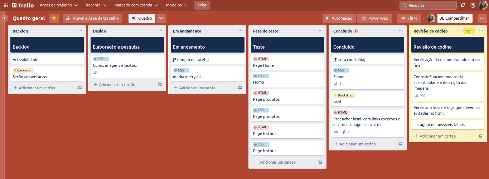

# Memórias Olfativas

## Qual é a sua melhor memória olfativa?

Este site foi feito para treinar o que aprendi nos meus estudos do front-end. Desde o começo, a idéia era construir um layout simples, que transmitisse uma idéia e passasse uma mensagem sobre como cheiros se tornam memórias olfativas muito especiais dentro de nós.

Para a execução, fiz um protótipo no figma com as primeiras noções que viessem na minha cabeça, e usei como base. Também organizei um quadro no Trello com tudo que deveria ser feito. 

Utilizei o conceito desktop first pois queria explorar ao máximo o que poderia inserir na tela. 

>Ferramentas e linguagens usadas:

  
  
  
  
  
  

 

>Prototipagem e organização:

  
  

 

<a href="https://memorias-olfativas.netlify.app/" target="_blank">Link para visualização do site</a>
 
  

  

